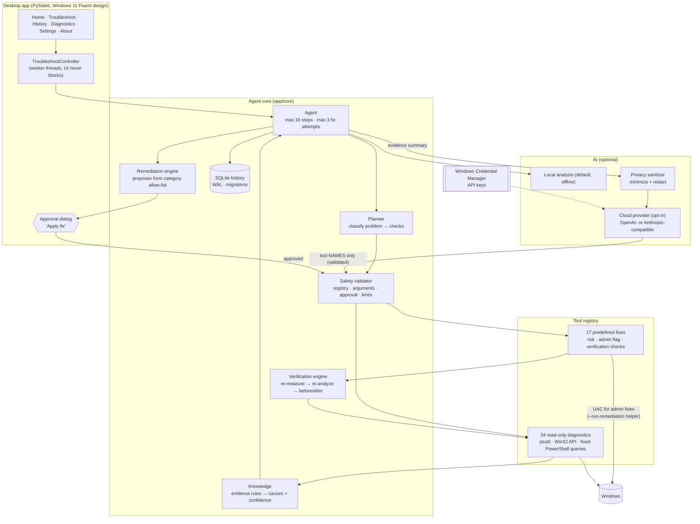
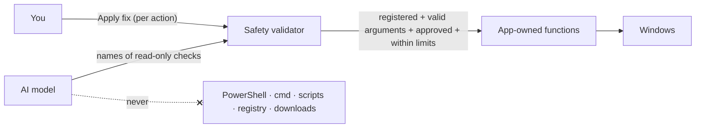

# WinFix AI

**Troubleshoot Windows problems with evidence, not guesswork.**

Describe a problem in your own words, such as *"My laptop is very slow"*,
*"Wi-Fi keeps disconnecting"* or *"Windows Update isn't working"*. WinFix AI then:

1. runs read-only checks on your PC,
2. shows you the measurements and the most likely cause,
3. proposes one fix from a fixed list of reviewed actions,
4. changes nothing until you approve it,
5. measures again and shows the before and after, so you know whether the fix worked.

It is a Windows 11-style desktop app (light and dark mode) built to a detailed
design spec. The AI can pick which **read-only** checks to run next; it can never
run commands, scripts, registry edits or code.

---

## Download (Windows 10 1809+ / Windows 11, 64-bit)

Get **WinFixAI.zip** (or **WinFixAI.exe**) from the
[latest release](https://github.com/Noyoucringe/WinFix-AI/releases/latest) or
from the **Build Windows executable** workflow run in the Actions tab (artifact
`WinFixAI-<commit>`). Each download has a `WinFixAI.sha256` file.

1. Check the file: `Get-FileHash .\WinFixAI.exe -Algorithm SHA256` must match
   `WinFixAI.sha256`.
2. Double-click `WinFixAI.exe`. You don't need an installer or Python.
3. The build isn't code-signed, so SmartScreen may say *"Windows protected your
   PC"*. Choose **More info → Run anyway** if you trust the source.

Some fixes (restarting a service or a network adapter) need administrator
rights. WinFix asks through the normal Windows UAC prompt, and only for that
single approved action. You don't need to run the whole app as administrator.

| What | Where |
|------|-------|
| History, settings, logs | `%LOCALAPPDATA%\WinFixAI` |
| API keys (only if you turn on cloud analysis) | Windows Credential Manager, entry `WinFix AI` |
| Start with Windows (optional) | `HKCU\...\Run` value `WinFix AI`, which runs a read-only `--health-check` |

To uninstall, turn off *Start with Windows* in Settings, then delete
`WinFixAI.exe` and `%LOCALAPPDATA%\WinFixAI`.

```text
WinFixAI.exe                 open the app
WinFixAI.exe --demo          sample data, simulated fixes (isolated; changes nothing)
WinFixAI.exe --self-test     go through every page and the full approval flow in demo
                             mode, then write a report (add --screenshots DIR for images)
WinFixAI.exe --health-check  quick read-only check (used at sign-in)
WinFixAI.exe --version
```

---

## Architecture



### The safety boundary



* **Only predefined functions change anything.** Each fix is a Python function
  that ships with the app and has fixed arguments, a risk level and an admin flag.
  There is no `eval`, `exec`, `shell=True` or free-form PowerShell anywhere. The
  safety tests check the source tree for this.
* **The AI never proposes fixes.** A cloud model may only name up to three extra
  **read-only** checks. Each name is validated against the registry, and anything
  else is rejected and logged. Fix proposals come from the evidence rules and the
  category's allow-list.
* **Approval is enforced twice**: by the dialog in the UI, and again by the
  safety validator, which refuses to run a fix unless `approved=True`.
* **Bounded:** `MAX_AGENT_STEPS = 10`, `MAX_REMEDIATION_ATTEMPTS = 3`, and a
  timeout on every tool.
* **Rejected by design:** arbitrary shell or PowerShell, arbitrary executables,
  arbitrary registry edits, arbitrary file deletion, driver downloads and
  anything that disables security features.

### Privacy

* Analysis is **local by default** and nothing leaves the PC.
* Cloud analysis is opt-in (Settings → AI provider). Only measurements and
  findings are sent. Process names and event-log excerpts are separate toggles.
  Every string is scrubbed of user names, the PC name, profile paths, IP and MAC
  addresses, e-mail addresses and anything that looks like a key or password.
  Each session records exactly what was sent, and History shows it.
* Passwords, tokens, API keys, browser cookies and personal files are never sent.
* API keys live in Windows Credential Manager. They are masked in the UI and are
  never written to settings, logs, history or the executable.

---

## What it can diagnose and fix

**34 read-only checks** cover system and uptime, CPU, memory (including
committed and compressed memory), disk activity and free space, reclaimable
space, running and unresponsive apps, startup apps, the network adapter,
gateway, DNS and internet, Wi-Fi, services (Search, Update, BITS, Audio,
Spooler, Bluetooth, WLAN), pending restarts, Windows Update, devices and
drivers, Bluetooth, and System and Application event logs.

**17 fixes**, all needing approval:

| Fix | Risk |
|-----|------|
| Clear temporary files older than a day · Flush DNS cache · Renew IP address | Low |
| Restart Windows Search / Update / BITS / Audio / Print Spooler / Bluetooth / WLAN service · Restart Explorer | Low |
| Empty Recycle Bin · Clear Windows Update cache (refused while an update installs) · Release IP address · Restart network adapter · End one unresponsive app (never system processes) | Medium |
| Reset Winsock (restart required; extra confirmation) | High |

---

## Project layout

```text
app/
  __init__.py       version (1.0.1), engine version, publisher
  main.py           entry point: GUI, --demo, --self-test, --health-check, CLI tools
  core/             models, tool registry, safety validator, planner, agent,
                    remediation/verification engines, elevation helper, history
                    (SQLite + migrations), settings, credentials, privacy,
                    autostart, health check, structured logging
  diagnostics/      read-only diagnostics + live sampler for the Diagnostics page
  remediation/      the predefined fixes
  knowledge/        categories, evidence rules, check and fix catalogs
  llm/              local and cloud providers, validated tool selection
  gui/              theme tokens, icons, motion, window chrome, controller,
                    widgets/ (Fluent controls), pages/ (one module per screen)
  demo.py           isolated demo mode (recorded evidence, simulated fixes)
  api/              optional FastAPI backend (not bundled in the exe)
tests/              unit · integration · safety · ui (offscreen)
scripts/            build.py, build_windows.ps1, generate_icon.py, version resource
WinFixAI.spec       PyInstaller spec
```

## Run from source

```powershell
git clone https://github.com/Noyoucringe/WinFix-AI.git
cd WinFix-AI
py -3.12 -m venv .venv
.venv\Scripts\activate
pip install -r requirements.txt
python -m app.main            # the desktop app
python -m app.main --demo     # sample data, simulated fixes
```

Developer commands: `python -m app.main tools` (list tools),
`python -m app.main diagnose "My Wi-Fi keeps disconnecting"`,
`python -m app.main serve` (optional HTTP API; fixes need `"approved": true`,
otherwise it returns 403).

## Tests

```powershell
python -m pytest                 # unit, integration, safety and UI tests
python -m pytest tests/safety    # the safety guarantees only
python -m app.main --self-test --offscreen --screenshots shots
```

The safety suite checks that shell commands, unregistered tools, invalid
arguments and unapproved fixes are rejected. It also checks that loops are
bounded, that secrets never reach logs or settings, and that the cloud payload
is sanitized. The UI tests open every page in both themes, check that API keys
are masked and never saved to settings, and run the packaged self-test flow.

## Build WinFixAI.exe

PyInstaller can't cross-compile, so build on Windows:

```powershell
powershell -ExecutionPolicy RemoteSigned -File scripts\build_windows.ps1
```

This creates `.venv-build`, installs the requirements plus PyInstaller, and runs
`scripts/build.py`, which:

1. checks that version numbers match and scans `app/` for anything that looks like a secret,
2. runs the whole test suite,
3. builds `dist/WinFixAI.exe` (one file, windowed, icon, version resource
   *WinFix AI 1.0.1 / publisher WinFix AI*),
4. checks the exe's contents: no `.env`, databases, settings, logs, tests or
   reports, and no key-like strings,
5. **starts the packaged exe** with `--self-test`, which opens every page in both
   themes, runs the full approve-and-verify flow in demo mode and operates every
   button, tab, toggle, dropdown and text box on every page (file dialogs,
   credential storage, "Start with Windows" and AI requests are replaced with
   harmless stand-ins during the test), and records the result,
6. writes `dist/WinFixAI.zip` (exe, README, LICENSE, THIRD-PARTY-NOTICES),
   `dist/WinFixAI.sha256`, `dist/build_report.txt` and `dist/test_report.txt`.

CI runs the same script on `windows-latest` for every push (see
`.github/workflows/build-windows.yml`) and uploads everything as an artifact.
Pushing a `v*` tag publishes a GitHub Release:

```bash
git tag v1.0.1 && git push origin v1.0.1
```

## Tech stack

Python 3.12 · PySide6 (Qt 6) · psutil · ctypes/Win32 · pydantic ·
SQLite · keyring (Windows Credential Manager) · httpx · PyInstaller · pytest.
Icons: Fluent UI System Icons (MIT). See `THIRD-PARTY-NOTICES.txt` in the zip.

## License

MIT. See [LICENSE](LICENSE).
