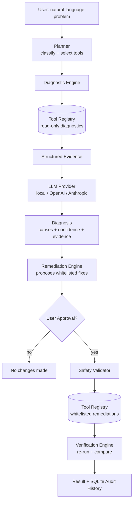
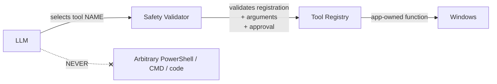
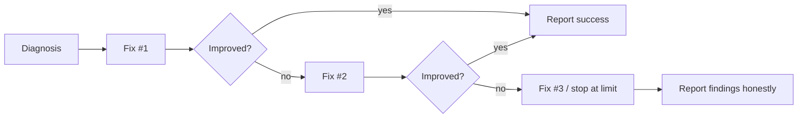

# WinFix AI

**An AI-powered Windows troubleshooting and remediation agent.**

Describe a problem in plain language — *"My laptop is very slow"*, *"My Wi-Fi
keeps disconnecting"*, *"Windows Update isn't working"* — and WinFix AI plans a
diagnosis, runs controlled read-only diagnostics, reasons over the evidence,
recommends a safe fix, **asks for your approval**, applies only whitelisted
remediations, and then verifies whether the problem actually improved.

WinFix AI is a real troubleshooting agent, not an LLM chatbot. The AI can
*choose* which registered tool to run; it can never generate or execute
arbitrary code.

---

## The problem

Windows troubleshooting is guesswork for most users. Advice found online is
often unsafe (arbitrary registry edits, random PowerShell scripts) and rarely
verifies whether it worked. Letting an LLM run shell commands directly is
dangerous.

## The solution

A bounded agent that operates inside a **controlled action space**:

```
USER → natural-language problem
     → AI agent classifies + plans
     → controlled read-only Windows diagnostics
     → structured evidence
     → AI analysis → diagnosis with confidence + evidence
     → USER APPROVAL (mandatory)
     → whitelisted remediation
     → verification (before/after)
     → result + audit history
```

Design priorities: **reliability > features, safety > autonomy, evidence > LLM
guesses, verification > assuming success, simple architecture > complexity.**

---

## Architecture



### The safety boundary



The LLM emits a **tool name** (e.g. `flush_dns`). The application owns the
implementation, validates the arguments, enforces approval and timeouts, and
executes the function. There is no `eval`, `exec`, or LLM-driven shell path
anywhere in the codebase — a fact the safety test suite asserts.

---

## Features

- **27 read-only diagnostics** across system, performance, processes, startup,
  network, services, devices, drivers, events, storage, updates, and apps.
- **16 whitelisted remediation actions** with risk levels, admin flags, and
  structured results.
- **Bounded agent loop** (max 10 diagnostic steps, max 3 remediation attempts).
- **Mandatory user approval** before any system change; stronger confirmation
  for high-risk actions.
- **Automatic verification** with before/after comparison — never assumes a fix
  worked.
- **Offline-first**: full local diagnostics and deterministic analysis work
  with no AI backend. The LLM only enriches the explanation.
- **SQLite audit history** of every session.
- **Three entry points**: PySide6 desktop GUI, FastAPI backend, and CLI.
- **Cross-platform-tolerant**: Windows-only tools degrade gracefully off
  Windows, so the whole test suite runs on CI/Linux.

---

## Safety model

| Guarantee | How it is enforced |
|-----------|--------------------|
| No arbitrary code execution | LLM selects registered tool names only; validated against the registry |
| Remediation requires approval | `SafetyValidator.validate_remediation(approved=...)` raises without it |
| Diagnostics are read-only | Diagnostic tools declare `read_only=True`; the engine refuses non-read-only tools |
| Bounded autonomy | `MAX_AGENT_STEPS`, `MAX_REMEDIATION_ATTEMPTS` |
| Arguments validated | Declared parameter schema, type-checked (bools rejected as ints) |
| Timeouts | Every tool runs with a timeout; a hang becomes an error result |
| Local-first privacy | Diagnostics stay local; only minimized evidence is sent to a cloud LLM |
| No secrets in logs/exe | API keys come from `.env` at runtime, never bundled or logged |

Protected system processes can never be terminated; storage remediations only
ever touch well-known temp/cache locations.

---

## Diagnostic engine

Every tool returns the same contract:

```json
{
  "success": true,
  "tool": "get_memory_usage",
  "data": { "usage_percent": 91, "available_gb": 1.4 },
  "error": null,
  "duration_ms": 12.3,
  "timestamp": "2026-09-24T...",
  "tool_version": "1.0"
}
```

A failing diagnostic never crashes the run — its error is recorded and the
engine continues, so partial evidence is always available.

## Agent architecture

The agent **reasons about relevance** rather than running everything. For
*"My laptop is very slow"* it selects CPU, memory, disk, top-process, and
startup diagnostics — not the network or Bluetooth tools. It exposes concise,
user-facing reasoning (e.g. *"CPU usage is normal, but memory utilization is
high"*), never hidden chain-of-thought.

## Remediation architecture

Remediations are predefined, whitelisted functions with metadata (risk,
admin requirement, verification tools). The engine proposes fixes ordered
low-risk-first, drawn only from the category's allowed set. Execution is gated
behind the safety validator's approval check.

## Verification loop



Verification re-runs the relevant diagnostics and compares measured signals
(CPU %, free GB, connectivity booleans, service state). Retries are capped at 3.

---

## Tech stack

- **Python 3.10+**
- **psutil** — cross-platform system metrics
- **Pydantic / pydantic-settings** — domain models & configuration
- **FastAPI + Uvicorn** — orchestration backend
- **PySide6** — desktop GUI
- **httpx** — cloud LLM REST calls (no vendor SDK required)
- **SQLite** — audit history
- **pytest** — test suite

---

## Installation

```bash
git clone https://github.com/Noyoucringe/WinFix-AI.git
cd WinFix-AI
python -m venv .venv
# Windows:  .venv\Scripts\activate
# Linux/mac: source .venv/bin/activate
pip install -r requirements.txt
cp .env.example .env   # optional: configure an AI backend
```

## Usage

```bash
python -m app.main gui                       # launch the desktop app (default)
python -m app.main diagnose "My Wi-Fi keeps disconnecting"
python -m app.main tools                     # list all registered tools
python -m app.main serve                     # start the FastAPI backend
python -m app.main report                    # save a JSON diagnostic report
```

### Backend API

```
GET  /api/health
GET  /api/tools
POST /api/diagnose                {"problem": "..."}
POST /api/agent/run               {"problem": "..."}
POST /api/remediation/approve     {"session_id": "...", "tool": "..."}
POST /api/remediation/execute     {"session_id": "...", "tool": "...", "approved": true}
POST /api/verify                  {"session_id": "..."}
GET  /api/history
GET  /api/history/{id}
```

Executing a remediation without `approved: true` returns **403**.

---

## Development

```bash
pip install -r requirements.txt
python -m pytest              # run all tests
python -m app.main tools      # sanity-check the registry
```

Project layout:

```
app/
  core/         config, logging, result contract, models, registry, safety,
                planner, engines (diagnostic/remediation/verification), agent, history
  diagnostics/  27 read-only Windows diagnostics
  remediation/  16 whitelisted remediation actions
  knowledge/    15 troubleshooting categories + offline evidence interpretation
  llm/          vendor-neutral LLM provider abstraction
  api/          FastAPI backend
  gui/          PySide6 desktop app (views, widgets, workers)
tests/          unit / integration / safety
scripts/        PyInstaller build script
```

## Testing

```bash
python -m pytest            # unit + integration + safety
python -m pytest tests/safety   # safety guarantees only
```

The safety suite verifies that arbitrary shell commands are rejected,
unregistered tools are rejected, remediation without approval is blocked,
invalid parameters are rejected, and the agent/remediation loops are bounded.

## Packaging

```bash
pip install pyinstaller
python scripts/build_exe.py   # produces dist/WinFix.exe (run on Windows)
```

The executable launches the GUI, reads configuration from a `.env` beside it,
and never contains API keys.

---

## Example troubleshooting flow

1. User: *"My laptop is very slow."*
2. Agent classifies it as a performance issue and plans CPU/memory/disk/
   process/startup diagnostics.
3. Diagnostics run read-only; evidence is collected (e.g. memory at 91%).
4. Analysis: *"System performance is likely affected by memory pressure —
   Chrome is using 4.8 GB."*
5. Recommends *"Close an unresponsive application"* (Low risk) and asks for
   approval.
6. On **Approve**, the whitelisted action runs.
7. Verification re-checks memory; reports **"Fix completed"** or, honestly,
   **"The recommended fix did not resolve the issue — here is what was found."**
8. The full session is saved to history.

---

## Security considerations

- Diagnostics stay local; only minimized, sanitized evidence is sent to a cloud
  LLM, and only when one is configured. Passwords, tokens, cookies, and personal
  files are never transmitted.
- The backend has no unrestricted machine access — it only invokes the same
  safety-checked registry. Windows-specific actions execute on the local client.
- `.env`, logs, generated reports, and the local database are git-ignored.

## Roadmap

- Client/server split so the desktop client executes Windows actions while a
  backend handles orchestration and LLM calls.
- Native LLM tool-calling loop (schemas are already exposed by the registry).
- More remediation categories and rollback snapshots where practical.
- Signed installer (MSI) in addition to the PyInstaller executable.

---

*WinFix AI — diagnose, prove, recommend, ask, fix, verify.*
